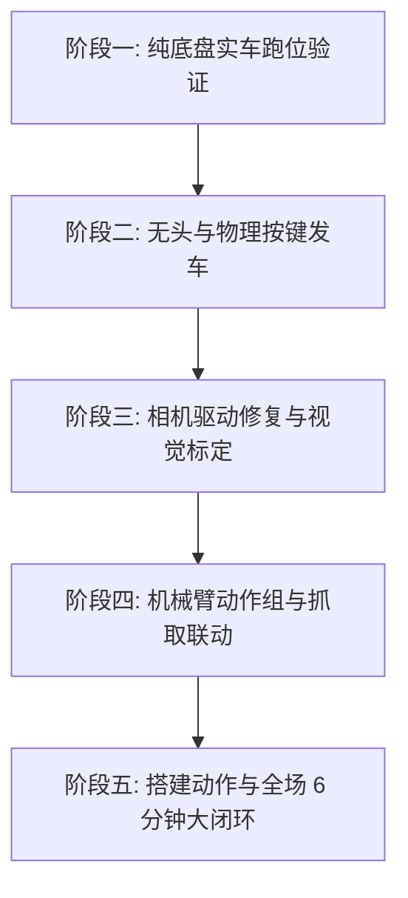

# RoboGame 2026 竞技组：控制系统全景问题汇总与实车调车流程指南

**文档版本**：v1.0 (2026-09-23)  
**适用硬件**：树莓派 4B (4GB) + RoboMaster STM32 A 板底盘 + LeArm 6 自由度总线舵机机械臂 + 1280×720 USB 广角摄像头  
**运行环境**：Debian 12 (aarch64) / Python 3.11 / Ultralytics 8.4 / PyTorch 2.9.0+cpu  

---

## 目录
1. [系统总体架构与当前运行机制](#一系统总体架构与当前运行机制)
2. [第一部分：全系统存在的问题与解决方案汇总](#二第一部分全系统存在的问题与解决方案汇总)
   - [模块 A：系统运行、界面与发车控制](#模块-a系统运行界面与发车控制)
   - [模块 B：视觉系统与 USB 摄像头底层驱动](#模块-b视觉系统与-usb-摄像头底层驱动)
   - [模块 C：机械臂协同与动作组](#模块-c机械臂协同与动作组)
   - [模块 D：轨迹规划与完整比赛战术闭环](#模块-d轨迹规划与完整比赛战术闭环)
3. [第二部分：关键实操代码与系统配置文件](#三第二部分关键实操代码与系统配置文件)
   - [2.1 双触发发车监听模块 (start_trigger.py)](#21-双触发发车监听模块-start_triggerpy)
   - [2.2 纯命令行主任务脚本 (run_autostart.py)](#22-纯命令行主任务脚本-run_autostartpy)
   - [2.3 systemd 开机自启动服务 (robogame.service)](#23-systemd-开机自启动服务-robogameservice)
   - [2.4 修复后的高性能摄像头驱动 (camera.py)](#24-修复后的高性能摄像头驱动-camerapy)
   - [2.5 底盘与相机时间测量脚本 (measure_timing.py)](#25-底盘与相机时间测量脚本-measure_timingpy)
4. [第三部分：五阶段实战调车标准流程](#四第三部分五阶段实战调车标准流程)
   - [阶段一：纯底盘实车跑位与空载 19 段验证](#阶段一纯底盘实车跑位与空载-19-段验证当前立即可做)
   - [阶段二：系统轻量化与开机自启配置](#阶段二系统轻量化与开机自启配置)
   - [阶段三：摄像头修复与视觉伺服精准标定](#阶段三摄像头修复与视觉伺服精准标定)
   - [阶段四：机械臂动作组联调与端到端抓取](#阶段四机械臂动作组联调与端到端抓取)
   - [阶段五：完整比赛战术闭环与返程扩展](#阶段五完整比赛战术闭环与返程扩展)
5. [附录：常用命令与引脚接线速查表](#五附录常用命令与引脚接线速查表)

---

## 一、系统总体架构与当前运行机制

整个系统采用 **“分层解耦、行为树驱动”** 的架构设计：
1. **决策层（树莓派 4B）**：运行行为树（Behavior Tree）调度引擎，维护全局世界坐标系与断点位移，负责视觉识别与动作节拍把控。
2. **底盘执行层（STM32 A 板）**：通过串口（115200 8N1 ASCII 协议）接收相对位移 `move(dx, dy, dyaw)`，进行编码器闭环电机控制与里程计推算。自动控制期间由树莓派每 30ms 下发 `auto_keepalive` 心跳保活。
3. **机械臂作业层（STM32 舵机板）**：通过独立串口（9600 8N1 二进制帧 `0x55 0x55 ...`）接收动作组控制命令，控制 6 自由度总线舵机执行固定抓取与搭建轨迹。

---

## 二、第一部分：全系统存在的问题与解决方案汇总

### 模块 A：系统运行、界面与发车控制

| 编号 | 现有问题 / 缺陷 | 原因与潜在危害 | 已确定的解决方案 |
| :---: | :--- | :--- | :--- |
| **A-1** | **代码强依赖 Tkinter 窗口** | `main.py` 强制创建 GUI。无屏幕开机或 SSH 运行时，缺少 `$DISPLAY` 会直接闪退崩溃。 | 剥离 Tkinter，编写纯命令行无头主程序 `run_autostart.py`，采用 50Hz 纯 Python 循环驱动。 |
| **A-2** | **桌面系统空耗资源与启动时间** | 树莓派默认启动图形桌面，耗费约 300MB 内存，开机时间长达 25 秒。 | 运行 `sudo raspi-config`，将启动模式设置为 `Console Autologin` 纯终端启动（开机时间缩短到 8 秒）。 |
| **A-3** | **比赛现场 SSH 断网导致小车熄火** | 小车驶出 WiFi 范围或丢包时，SSH 断连会向进程发送 `SIGHUP` 信号杀死程序，导致小车死在赛道中。 | 必须在终端复用工具 `tmux` 会话内运行程序（`tmux new -s car`），彻底免疫网络断开影响。 |
| **A-4** | **缺少可靠安全的比赛发车机制** | 开机自启动不能通电瞬间就发车（操作手尚未在发车区摆正车身）。 | 编写 `start_trigger.py` 实现**双触发机制**：平时调试在 SSH 终端敲回车发车，比赛时抱车就位后按一下物理按键发车。 |

---

### 模块 B：视觉系统与 USB 摄像头底层驱动

| 编号 | 现有问题 / 缺陷 | 原因与潜在危害 | 已确定的解决方案 |
| :---: | :--- | :--- | :--- |
| **B-1** | **分辨率未显式指定，默认退化** | `CvCamera` 未传参，Linux V4L2 默认退化到 640×480。标定目标点 `(940.5, 366.0)` 在画面外，车身永远无法对准。 | 显式强制设置摄像头参数：宽 `1280`、高 `720`。 |
| **B-2** | **默认 YUYV 编码撑爆 USB 带宽** | 1280×720 无压缩 YUYV 每帧达 1.84MB，30FPS 产生 55MB/s 数据流，超出 USB 2.0 上限（35MB/s），引发卡死、掉帧或串口掉线。 | 开启摄像头硬件 JPEG 压缩：`VideoWriter_fourcc(*'MJPG')`，数据流降至 3MB/s，流畅稳定。 |
| **B-3** | **V4L2 硬件帧缓冲残留旧残影** | Linux V4L2 内部有 4 帧环形队列。底盘刚走完 3cm 停下拍照，读到的往往是**移动前的历史旧帧**，引发微调死循环或反向发散。 | 设置 `CAP_PROP_BUFFERSIZE = 1`，并在拍照前调用 `for _ in range(3): cap.grab()` 冲刷掉旧帧。 |
| **B-4** | **频繁写 SD 卡增加延迟损耗** | 原代码每次拍照调用 `cv2.imwrite("vision/_frame.jpg")`，YOLO 再从磁盘读图，增加 50ms 读写延迟且伤卡。 | 废弃存盘逻辑，直接将内存中的 `frame`（NumPy 矩阵）传给 YOLO 模型直接推理。 |
| **B-5** | **标定基准点与微调符号未实车确定** | 目标像素中心 `(target_u, target_v)` 与方向符号 `u_sign, v_sign` 尚未在真车上做机械臂夹取匹配。 | 手动推车对准物理紫色块，实拍照片运行 `detect_image.py` 标定原点，实车单步测试微调移动方向。 |

---

### 模块 C：机械臂协同与动作组

| 编号 | 现有问题 / 缺陷 | 原因与潜在危害 | 已确定的解决方案 |
| :---: | :--- | :--- | :--- |
| **C-1** | **0x06 动作组二进制帧格式待实机确认** | 机械臂驱动 `run_group` 的 payload 格式（1字节 group_id + 2字节 times）需与固件核对。 | 使用独立串口脚本单发动作组 1 测试舵机运行情况。 |
| **C-2** | **机械臂作业期间底盘未严格锁死** | 动作组运行要求底盘绝对静止。若底盘处于滑动或漂移，抓取会扑空。 | 在调用机械臂前，行为树强制下发 `stop` 指令清零速度，并检查 `motion_state != 1`。 |

---

### 模块 D：轨迹规划与完整比赛战术闭环

| 编号 | 现有问题 / 缺陷 | 原因与潜在危害 | 已确定的解决方案 |
| :---: | :--- | :--- | :--- |
| **D-1** | **当前仅实现单程去程 19 段轨迹** | 代码只走到搭建区工位停止（段 18），未在终点挂载搭建动作，也没有规划返回材料区的返程轨迹。 | 在 `main_mission.py` 段 18 之后挂接机械臂搭建节点；在 `mission_config.py` 中追加倒车、掉头、走廊返程轨迹。 |
| **D-2** | **14 米全场累计打滑漂移风险** | 纯麦轮航位推算在走完长距离后，终点物理偏差可能积累至 10~20cm。 | 先做实车跑位测算；若偏差超标，在通道处加装车底红外对管，通过 `hardware/ir_sensor.py` 对准黑线复位里程计。 |

---

## 三、第二部分：关键实操代码与系统配置文件

### 2.1 双触发发车监听模块 (`start_trigger.py`)
在 `robogame_project/start_trigger.py` 中创建：
```python
# start_trigger.py
"""双触发发车模块：支持车身物理按键 (GPIO 21) 与 SSH 命令行回车双模式发车"""
import threading

def wait_for_start(button_pin: int = 21):
    trigger_event = threading.Event()

    # 1. 监听车身物理微动开关 (接 GPIO 21 与 GND)
    try:
        from gpiozero import Button
        btn = Button(button_pin, pull_up=True, bounce_time=0.1)
        btn.when_pressed = lambda: trigger_event.set()
        print(f"[Trigger] 车身物理按键就绪 (GPIO {button_pin})")
    except Exception as e:
        print(f"[Warning] GPIO 按键初始化跳过: {e}")

    # 2. 监听 SSH 终端回车
    def _listen_stdin():
        try:
            input()
            trigger_event.set()
        except Exception:
            pass

    t = threading.Thread(target=_listen_stdin, daemon=True)
    t.start()

    print("==================================================")
    print(" >>> 机器人准备就绪！请选择发车方式：<<<")
    print("   方式 1: 按下车身上的【物理按键】")
    print("   方式 2: 在 SSH 命令行敲击【回车键 (Enter)】")
    print("==================================================")

    trigger_event.wait()
    print("\n[Trigger] >>> 收到发车触发信号！任务正式启动！<<<\n")
```

---

### 2.2 纯命令行主任务脚本 (`run_autostart.py`)
在 `robogame_project/run_autostart.py` 中创建：
```python
# run_autostart.py
"""纯命令行一键自启动入口：脱离 Tkinter，支持断电开机与比赛发车"""
import time
import sys
from config.mission_config import GLOBAL_CONFIG
from core.chassis_driver import ChassisDriver
from core.arm_driver import ArmDriver
from environment.world_model import WorldModel
from missions.main_mission import create_mission_tree
from start_trigger import wait_for_start

def main():
    print("[System] 正在启动机器人控制系统...")
    time.sleep(1.5)  # 等待 USB 串口设备节点就绪

    # 1. 初始化底盘
    chassis = ChassisDriver(port="/dev/ttyUSB0", baudrate=115200, simulate=False)
    lim = GLOBAL_CONFIG.limits
    chassis.set_motion_limits(
        max_x=lim.max_x_m, max_y=lim.max_y_m, max_yaw=lim.max_yaw_rad,
        max_v=lim.max_velocity_m_s, max_w=lim.max_yaw_rate_rad_s,
        pos_tol=lim.position_tolerance_m, yaw_tol=lim.yaw_tolerance_rad,
        max_ms=lim.max_duration_ms,
    )
    if not chassis.connect():
        print(f"[Error] 底盘握手失败: {chassis.connection_error}")
        sys.exit(1)
    print("[System] 底盘握手成功 (A 板已就绪)")

    # 2. 初始化机械臂（未连接时自动降级纯底盘模式）
    arm = None
    try:
        arm = ArmDriver(port="/dev/ttyUSB1", baudrate=9600)
        arm.connect()
        print("[System] 机械臂已连接")
    except Exception as e:
        print(f"[Warning] 机械臂未连接，进入纯底盘模式: {e}")

    # 3. 初始化视觉与摄像头
    detector, camera = None, None
    try:
        from vision.yolo_detector import YoloDetector
        from vision.camera import CvCamera
        detector = YoloDetector("best.pt")
        camera = CvCamera(index=0)
        print("[System] 视觉与摄像头就绪")
    except Exception as e:
        print(f"[Warning] 视觉模块未启用: {e}")

    world = WorldModel(chassis)
    tree = create_mission_tree(chassis, world, ir_sensor=None,
                               detector=detector, camera=camera, arm=arm)

    # 4. 等待物理按键或 SSH 回车触发
    wait_for_start(button_pin=21)

    # 5. 50Hz 纯无头事件主循环
    print("[Mission] 开始执行行为树主逻辑...")
    while True:
        chassis.poll()
        chassis.maintain()
        status = tree.tick()
        seg = world.get_current_segment()
        odom = chassis.odom_data
        print(f"\r当前段: {seg.name if seg else '已全部完成':16s} | X={odom['rel_x']:+.2f}m Y={odom['rel_y']:+.2f}m Yaw={odom['rel_yaw']:+.2f}rad", end="", flush=True)
        if status.name in ("SUCCESS", "FAILURE"):
            print(f"\n[Mission] 任务结束，最终状态: {status.name}")
            break
        time.sleep(0.02)

if __name__ == "__main__":
    main()
```

---

### 2.3 systemd 开机自启动服务 (`robogame.service`)
在树莓派终端创建 `/etc/systemd/system/robogame.service`：
```ini
[Unit]
Description=RoboGame 2026 AutoStart Mission Service
After=network.target

[Service]
Type=simple
User=pinqu
WorkingDirectory=/home/pinqu/robot-stack/robogame_project
ExecStart=/usr/bin/python3 run_autostart.py
Restart=no
StandardOutput=append:/home/pinqu/robot-stack/robogame_project/run.log
StandardError=append:/home/pinqu/robot-stack/robogame_project/run.log

[Install]
WantedBy=multi-user.target
```
生效命令：
```bash
sudo systemctl daemon-reload
sudo systemctl enable robogame.service
```

---

### 2.4 修复后的高性能摄像头驱动 (`vision/camera.py`)
将现有 `vision/camera.py` 重构为以下高性能版本：
```python
# vision/camera.py
"""高性能 OpenCV 摄像头驱动：支持 MJPG 硬件压缩、1280x720 分辨率锁定与旧帧冲刷"""
import cv2

class FileCamera:
    def __init__(self, image_path: str):
        self.image_path = image_path
    def capture(self):
        return self.image_path

class CvCamera:
    def __init__(self, index: int = 0):
        self.cap = cv2.VideoCapture(index)
        # 1. 强制使用硬件级 MJPG 压缩，避免撑爆 USB 2.0 带宽
        self.cap.set(cv2.CAP_PROP_FOURCC, cv2.VideoWriter_fourcc(*'MJPG'))
        # 2. 强制锁定 1280x720 分辨率，匹配标定坐标
        self.cap.set(cv2.CAP_PROP_FRAME_WIDTH, 1280)
        self.cap.set(cv2.CAP_PROP_FRAME_HEIGHT, 720)
        # 3. 限制底层缓存队列长度
        self.cap.set(cv2.CAP_PROP_BUFFERSIZE, 1)

        # 启动预热，读取 5 帧丢弃，使芯片自动曝光与白平衡稳定
        for _ in range(5):
            self.cap.grab()
        print("[Camera] 摄像头已打开 (1280x720 @ MJPG)，预热完成")

    def capture(self):
        """丢弃 3 帧旧残影缓存，返回当前内存中的最新瞬时图像 (NumPy ndarray)"""
        for _ in range(3):
            self.cap.grab()
        ok, frame = self.cap.read()
        if not ok:
            print("[Error][Camera] 捕获图像失败")
            return None
        return frame

    def release(self):
        if self.cap:
            self.cap.release()
```

---

### 2.5 底盘与相机时间测量脚本 (`measure_timing.py`)
在根目录下新建用于实测硬件耗时的工具脚本：
```python
# measure_timing.py
import time
import cv2
from core.chassis_driver import ChassisDriver
from vision.yolo_detector import YoloDetector

chassis = ChassisDriver(port="/dev/ttyUSB0", baudrate=115200, simulate=False)
assert chassis.connect(), "底盘连接失败"
cap = cv2.VideoCapture(0)
cap.set(cv2.CAP_PROP_FOURCC, cv2.VideoWriter_fourcc(*'MJPG'))
cap.set(cv2.CAP_PROP_FRAME_WIDTH, 1280)
cap.set(cv2.CAP_PROP_FRAME_HEIGHT, 720)
detector = YoloDetector("best.pt")

print("=== 正在测量底盘微调与视觉处理耗时 ===")
# 1. 下发 3cm 微调，测量刹停耗时
t0 = time.perf_counter()
chassis.send_command("move,0.030,0.000,0.000\r\n")
while True:
    chassis.poll()
    if chassis.odom_data["motion_state"] == 2:
        break
    time.sleep(0.01)
t1 = time.perf_counter()
print(f"1. 底盘微调 3cm 移动及停稳耗时: {(t1 - t0)*1000:.1f} ms")

# 2. 测量采图耗时
for _ in range(3): cap.grab()
ret, frame = cap.read()
t2 = time.perf_counter()
print(f"2. 相机单帧捕获真实耗时: {(t2 - t1)*1000:.1f} ms")

# 3. 测量 YOLO 推理耗时
dets = detector.model.predict(source=frame, conf=0.5, verbose=False)
t3 = time.perf_counter()
print(f"3. YOLO 真实单帧推理耗时: {(t3 - t2)*1000:.1f} ms")
print(f">>> 单次视觉微调闭环总耗时: {(t3 - t0)*1000:.1f} ms ({(t3 - t0):.2f} 秒) <<<")
cap.release()
```

---

## 四、第三部分：五阶段实战调车标准流程



### 阶段一：纯底盘实车调试三步法（悬空微调 $\rightarrow$ 交互点动 $\rightarrow$ 落地 19 段）
> **目的**：在不接机械臂和摄像头的情况下，排查 A 板通信链路、电机接线极性、麦轮逆运动学解算与全场 19 段累计航位推算误差。**严禁未经悬空与交互验证直接放地发车！**

#### 步骤 1.1：悬空微动安全测试（Wheels-in-the-air Test）
* **命令**：
  ```bash
  cd ~/robot-stack/robogame_project
  python3 test_chassis_motion.py --step-test
  ```
* **分步指引与含义**：
  1. **物理架空车身**：用木块或包装盒将车架起，确保 4 个麦轮完全离地 3~5cm 并能顺畅空转。*【含义：确保电机反转或失控时整车绝对静止，零碰撞风险】*；
  2. **供电与连线**：打开 24V 电池开关，插入 A 板 USB 线至树莓派口。*【含义：使电机驱动 H 桥通电，建立串口通信】*；
  3. **观察四步握手**：终端依次下发 `stop` $\rightarrow$ `motion_cfg` $\rightarrow$ `odom_reset` $\rightarrow$ `telemetry`，必须全绿（`[Pass]`）。*【含义：验证波特率与协议严格匹配，清空脏数据】*；
  4. **30ms 心跳保活**：终端提示 `[Heartbeat] 30ms keepalive 线程启动`。*【含义：解除下位机 100ms 看门狗锁死】*；
  5. **肉眼观察车轮转向**：自动下发 `move,0.100,0.000,0.000`（10cm 前进）。**4 个轮子必须全部同步向前旋转**并在约 1 秒后平稳减速刹停。*【含义：若有对角线轮反转或原地打转，说明电机线或编码器正负极接反，需调线】*；
  6. **里程计反馈确认**：检查 `odom_x` 稳定递增至约 `+0.100m`，`motion_state` 切换为 `2 (Done)`。*【含义：确认底层位置环闭环 PID 控制收敛】*；
  7. **急停预案**：若转速异常，立即在终端按 `Ctrl+C`（软件连发 3 次 `stop`），或拍下 24V 物理急停开关。

#### 步骤 1.2：交互式全向运动控制与遥测测试（Interactive CLI Test）
* **命令**：
  ```bash
  cd ~/robot-stack/robogame_project
  python3 test_chassis_motion.py
  ```
* **分步指引与含义**：
  1. **进入控制台**：加载 0~8 号功能菜单。*【含义：脱离顶层行为树，单项解耦验证各自由度】*；
  2. **选 [1] Ping 测试**：确认串口连通性与单步通信延迟（< 10ms）；
  3. **选 [3] 前进 10cm / [4] 后退 10cm**：测试 X 轴纵向平移，4 轮同向同速旋转；
  4. **选 [5] 左平移 10cm / [6] 右平移 10cm**：测试 Y 轴横向平移。麦轮对角轮反转产生侧向合力。**车身必须产生纯侧向平移，不得伴随车头自转**。*【含义：若横移变自转，说明 M1~M4 轮序与麦轮“X”型辊子排布定义相反】*；
  5. **选 [7] 原地旋转 90 度**：下发 `move,0,0,1.571`，左侧轮倒转、右侧轮正转。*【含义：验证陀螺仪角速度反馈闭环与 90° 旋转对齐精度】*；
  6. **选 [2] 实时遥测看板**：观察电池电压（确保 >22.2V）、静止坐标漂移（< 1mm/s）与电机空载电流（< 0.5A），按 `q` 退出；
  7. **选 [8] 验证 E-Stop**：点动中输入 8，验证电机 10ms 瞬间停机。

#### 步骤 1.3：实车落地正常运行 19 段去程位移（Full 19-Segment Mission Run）
* **命令**：
  ```bash
  # 必须使用 tmux 会话，彻底免疫现场 WiFi 断网中断
  ssh pinqu@172.20.10.3
  tmux new -s car
  cd ~/robot-stack/robogame_project
  python3 run_autostart.py
  ```
  *(注：保持后台运行按 `Ctrl+B` 然后按 `D`；重新连回查看键入 `tmux attach -t car`)*
* **分步指引与含义**：
  1. **自检等待就绪**：程序自检底盘、清零里程计，打印 `机器人准备就绪！敲击【回车键】发车`。*【含义：确立统一的世界坐标系原点】*；
  2. **赛道发车站摆位**：四轮平放发车方框内，车头严格对正起跑基准白线，人员撤出赛道，双手离开车体。*【含义：发车站 1cm 的摆位偏差在全场 14 米后会被放大，起跑必须严谨】*；
  3. **敲击回车发车**：在 SSH 终端敲击 `Enter`，行为树以 50Hz 循环启动驱动小车；
  4. **19 段沿途重点工位检查**：
     - **段 0~4**：直行 0.6m $\rightarrow$ 右横移 2.75m（查右侧护栏间隙） $\rightarrow$ 直行 2.25m $\rightarrow$ 左横移 0.5m 靠物料台。**观察停车后机械臂安装面与物料台物理间隙是否在 10~15cm（适宜夹取）** $\rightarrow$ 右横移 0.6m 脱离；
     - **段 5~9**：倒车 2.25m $\rightarrow$ 左转 90° $\rightarrow$ 横移入廊 $\rightarrow$ 右转 90° $\rightarrow$ 直行 2.0m 穿走廊。**检查两侧挡板富余间隙，确保高速直行不擦碰**；
     - **段 10~14**：走廊出口左右避障微调 0.5m/0.7m 绕开立柱 $\rightarrow$ 右转 90° $\rightarrow$ 横移切入搭建区通道；
     - **段 15~18**：直行 2.3m $\rightarrow$ 右转 90° 车头对正 $\rightarrow$ 直行 2.6m 停靠搭建平台工位 $\rightarrow$ 底盘下发 `stop` 驻车锁死；
  5. **停稳测量与误差判定**：对比小车实际停靠位置与理想工位基准线。
     - **优（< 3cm）**：可直接联动机械臂执行固定点位搭建；
     - **良（3 ~ 8cm）**：增加 1 次红外对准或视觉微调抹平；
     - **超标（> 10cm）**：在 `mission_config.py` 中对打滑段增加补偿系数（如 1.02）；
  6. **紧急制动**：终端按 `Ctrl+C` 软件急停，或随车安全员拍下 24V 物理急停开关。

---

### 阶段二：系统轻量化与开机自启配置
> **目的**：彻底摆脱屏幕、键盘和鼠标，实现“抱车就位 $\rightarrow$ 一键发车”。

1. **接按键**：将物理轻触开关两根线分别插入树莓派 **Pin 39 (GND)** 和 **Pin 40 (GPIO 21)**；
2. **关闭系统桌面**：运行 `sudo raspi-config`，选择 `Console Autologin` 纯终端启动并重启；
3. **部署脚本**：将 `start_trigger.py` 和 `run_autostart.py` 放入工程目录；
4. **验证开机自启**：配置并启用 `robogame.service`。给树莓派重新上电，在车身上按下微动开关，验证小车能否正常起跑发车。

---

### 阶段三：摄像头修复与视觉伺服精准标定
> **目的**：彻底解决残影与分辨率缺陷，标定真实的物料抓取原点。

1. **更新相机驱动**：将 2.4 节优化后的 `vision/camera.py` 写入工程；
2. **测量耗时基准**：运行 `python3 measure_timing.py`，确认单次微调周期在 0.6 ~ 0.9 秒内；
3. **标定物理原点**：
   - 小车停在段 3 物料台前，手动将机械臂爪子伸出，对准物料台上的紫色方块；
   - 拍摄一张照片 `ground_truth.jpg`，执行：
     ```bash
     python3 -m vision.detect_image ground_truth.jpg
     ```
   - 记录终端输出的 `(u*, v*)`，填入 `config/mission_config.py` 中的 `target_u` 和 `target_v`；
4. **标定移动符号**：将车故意往后挪开 5cm，执行单步对准，观察车是前进还是后退。如果反向，将 `VisionConfig.u_sign` 从 `1` 改为 `-1`。纵向同理验证 `v_sign`。

---

### 阶段四：机械臂动作组联调与端到端抓取
> **目的**：打通在材料区“视觉对准 $\rightarrow$ 夹取紫色块 $\rightarrow$ 存入料框”的全套工序。

1. **串口验证**：机械臂插上树莓派 `/dev/ttyUSB1`，运行 `ArmDriver.run_group(1)`，验证动作组 1 舵机能否完整执行；
2. **工位联动测试**：带上视觉与机械臂，小车从起点发车，到达段 3 后观察：
   - 底盘自动根据视觉完成 2~3 步微调；
   - 对准后底盘锁死刹停，机械臂伸出精准夹取紫色块放入料框；
   - 动作组完成后顺利脱出，底盘继续执行段 4 的倒车与转弯。

---

### 阶段五：完整比赛战术闭环与返程扩展
> **目的**：补齐搭建动作与返程轨迹，实现 6 分钟比赛多趟运输闭环。

1. **挂接搭建动作**：在 `missions/main_mission.py` 段 18 之后挂接搭建节点（`GROUP_BUILD_1`）；
2. **规划返程轨迹**：在 `config/mission_config.py` 中追加段 19~25：后退脱离搭建台 $\rightarrow$ 180° 旋转掉头 $\rightarrow$ 沿走廊高速返回物料区；
3. **整场 6 分钟计时演练**：使用秒表实测单趟运输耗时（目标控制在 1.5~2 分钟），演练 6 分钟内运送 2~3 趟物料的高分战术。

---

## 五、附录：常用命令与引脚接线速查表

### 1. 物理引脚接线表
| 物理引脚编号 (Pin) | 功能定义 | 对应连接外部硬件 |
| :---: | :---: | :--- |
| **Pin 39** | GND (接地) | 物理发车微动按键（一脚） |
| **Pin 40** | GPIO 21 | 物理发车微动按键（另一脚） |
| **Pin 6 / 9 / 14** | GND (备用) | 车底红外巡线传感器接地 |
| **Pin 16** | GPIO 23 | 车底红外巡线传感器信号线 (预留) |

### 2. 比赛现场常用 Linux 维护指令
```bash
# 1. 临时断开自启动服务（调车调试时使用）
sudo systemctl stop robogame.service

# 2. 重新启用自启动服务
sudo systemctl start robogame.service

# 3. 实时跟踪查看小车后台运行日志（极重要）
tail -f ~/robot-stack/robogame_project/run.log

# 4. SSH 守护模式发车
tmux new -s car
python3 run_autostart.py
# 退出查看保持后台运行：按 Ctrl+B 然后按 D
# 重新进入查看：tmux attach -t car
```
