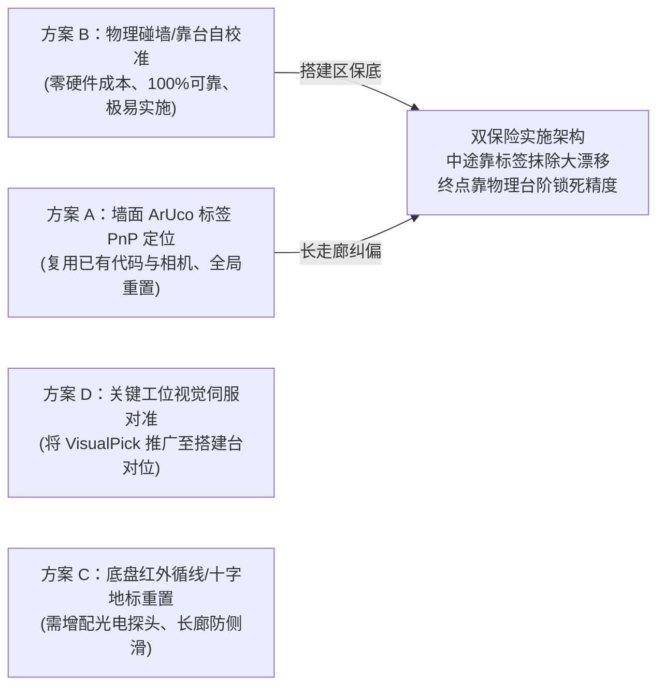
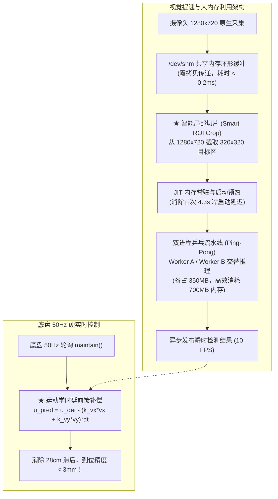

# RoboGame 2026：运动轨迹偏差消除与 YOLO 推理优化深度规划报告

---

## 一、 核心问题剖析：运动发生巨大物理偏差，为何小车完全无法感知？

在本次实车 17 段轨迹推进中，小车物理位置出现了显著的累积偏航甚至刮蹭风险，但上位机与下位机遥测日志每段均回报 `漂移误差=0.0050m`（误判为“极度精准到位”）。

```mermaid
flowchart TD
    subgraph 物理层：本质滑移与几何放大
        M1["段 1：2.75m 极限全横移<br/>(麦轮 45° 辊子侧向滑移率达 8%~15%)"] --> S1["真实物理侧滑损失 20~40cm<br/>(编码器转足圈数，车身未到位)"]
        M2["段 6/8/12/15：4 次 90° 直角旋转<br/>(陀螺仪/电机残存微小航向偏角 2°~3°)"] --> S2["长直道前向位移杠杆放大：<br/>ΔY = 2.6m × sin(3°) ≈ 13.6cm"]
        S1 & S2 --> TrueDrift["物理世界真实累积漂移：20cm ~ 50cm"]
    end

    subgraph 软件层：闭环盲区与自证循环
        CMD["上位机下发 move(dx, dy)"] --> Board["A 板电机 PID 闭环跟踪目标编码器脉冲"]
        Board --> Odom["A 板根据电机转速积分生成 odom(rel_x, rel_y)"]
        Odom --> WM["WorldModel 计算 drift_error:<br/>hypot(odom - expected_pose)"]
        WM --> Loop["误差永远在 5mm 稳态容差内！<br/>★ 算法在测量自己的轮子，无法感知物理世界！"]
    end

    TrueDrift -.->|完全缺乏外部真实基准输入| Loop
```

### 1.1 软件自证盲区（致盲根因）
审查 [environment/world_model.py](file:///d:/competition_code/rb_competition_code/rb_pi/pi/robogame_project/environment/world_model.py)：
```python
def drift_error(self) -> float:
    odom = self.chassis.odom_data
    dx = odom["rel_x"] - self.expected_pose["x"]
    dy = odom["rel_y"] - self.expected_pose["y"]
    return math.hypot(dx, dy)
```
- **下位机 A 板**：控制对象是**电机编码器脉冲数**。只要车轮旋转达到设定脉冲，A板就判定动作到达；即使轮子在地面打滑空转，下位机也认为自己走了对应距离。
- **上位机树莓派**：`expected_pose` 是把代码里静态写入的理论段位移 `seg.dx, seg.dy` 累加；下位机回传的 `odom` 也是底盘转足圈数后的数值。
- **结论**：`drift_error` 衡量的**仅是下位机电机闭环跟踪上位机指令的稳态跟踪误差（≤ 5mm），完全无法反映真实物理世界的车体位移**。

### 1.2 麦轮物理滑移与长廊杠杆放大
1. **段 1（`right_2.75m`）横移滑模损失**：麦克纳姆轮横移依靠 45° 辊子侧向分力，实测侧向滑移率高达 8%~15%。仅这一段，实际物理侧滑损失就达到 **20~40cm**！
2. **航向微偏在长直道的杠杆放大**：在经历多次直角转向后，只要航向角残留仅仅 $2^\circ \sim 3^\circ$ 的微偏，在后续段 16（2.3m）和段 18（2.6m）的长走廊中，前进位移就会在横向凭空投影出 $\Delta Y = 2.6\text{m} \times \sin(3^\circ) \approx \mathbf{13.6\text{cm}}$ 的横向偏差，直接导致小车蹭墙或对不准搭建台。

---

## 二、 赛场天然绝对基准与 4 大矫正方案深度调研

根据《RoboGame 2026 规则手册》第 3.1.4、3.1.6 与 3.1.8 条款，赛场具备极好的结构化先验信息。综合调研对比出 4 套纠偏方案：



### 方案对比与实施可行性矩阵

| 方案 | 矫正原理 | 硬件改动 | 软件工作量 | 精度与稳定性 | 推荐等级 |
| :--- | :--- | :---: | :---: | :---: | :---: |
| **方案 B：物理碰台自校准** | 到达搭建台（100mm 刚性台阶）前，以 0.08m/s 低速顶靠挡板 1 秒，利用麦轮打滑自整平车身并重设原点 | **0 元** (利用现有车身防撞梁) | **极低** (新增 1 个 BT 动作节点) | **极高**（机械锁死，精度 $\le 2\text{mm}$，航向绝对 $0^\circ$，彻底免疫光照反光） | **首选保底 (第一步)** |
| **方案 A：墙面 ArUco 标签 PnP 纠偏** | 规则 3.1.8 明确在墙体设有 6 个 15×15cm 视觉标签。利用单目 PnP 解算相机相对标签位姿，重置全局 $(x, y, \text{yaw})$ | **0 元** (复用现有 USB 摄像头) | **低** (已有成熟算法可直接移植) | **高**（米级距离内误差 $\le 5\text{mm}$，消除全局累积漂移） | **首选全局 (第二步)** |
| **方案 D：关键工位分段视觉伺服** | 复用段 3 抓紫色块的负反馈对准逻辑，在搭建区对准搭建台台阶边缘特征微调底盘 | **0 元** (复用现有 USB 摄像头) | **低** (复用 `VisualPickAction` 框架) | **高**（终端像素对齐，实物误差 $\le 3\text{mm}$） | **工位扩展推荐** |
| **方案 C：底盘红外循线/地标清零** | 利用赛道 5cm 黑色胶带，车底加装 8 路红外阵列，横移闭环抗侧滑；十字路口单轴硬清零 | 需增配 1 块 8 路红外对管 (~30元) | **中** (需打通 GPIO/ADC 驱动) | **高**（长廊动态跟踪极稳，但易受地面反光影响） | 后续选配升级 |

---

### 详细落地方案剖析

#### 1. 方案 B：物理碰墙/靠台自校准 (Mechanical Hard-Stop Calibration)
- **实现机理**：
  在小车即将到达搭建区前（段 18 `forward_2.6m`），修改为前进 `2.5m` + 故意超调指令 `forward_contact_0.2m`，下发 $0.08\text{m/s}$ 低速推靠搭建台（规则 3.1.4 标明搭建台为 **100mm 高刚性垂直台阶**）。
  由于两前轮接触台阶受阻，麦轮辊子在台阶边缘滑动产生反力矩，**车身会被机械强制瞬间整平（Yaw 轴绝对对齐台阶法线，横向贴紧）**。持续 0.8 秒后发送 `odom_reset`，此时小车相对搭建台的距离与角度误差被**物理机械归零**！
- **代码实施**：在 [behavior_tree/custom_actions.py](file:///d:/competition_code/rb_competition_code/rb_pi/pi/robogame_project/behavior_tree/custom_actions.py) 中新增 `HardStopAlignAction`：
  ```python
  class HardStopAlignAction(BTNode):
      def __init__(self, chassis, world_model, target_coord=2.60):
          self.chassis = chassis
          self.world = world_model
          self.target_coord = target_coord
          self.start_t = 0.0

      def tick(self) -> NodeStatus:
          now = time.monotonic()
          if self.start_t == 0.0:
              self.start_t = now
              self.chassis.set_velocity(0.08, 0.0, 0.0)  # 低速推靠
              return NodeStatus.RUNNING
          if now - self.start_t < 1.0:
              return NodeStatus.RUNNING
          self.chassis.stop()
          self.world.expected_pose["x"] = self.target_coord
          self.world.expected_pose["yaw"] = 0.0
          self.chassis.send_command("odom_reset")
          print(f"[HardStop] 物理机械靠台对齐完成，位姿绝对归零！")
          return NodeStatus.SUCCESS
  ```

#### 2. 方案 A：墙面 ArUco 标签 PnP 定位纠偏 (Tag-based PnP Relocalization)
- **现有资产**：
  在 [RoboGame-Team/src/robogame2026_auto/perception_node.py](file:///D:/competition_code/rb_competition_code/RoboGame-Team/src/robogame2026_auto/perception_node.py) 中已经完整实现了基于 OpenCV 的 ArUco 识别与位姿矩阵反解算法（`process_aruco` 和 `solve_robot_pose_from_tag`）。
- **实现机理**：
  在段 9（穿越走廊后）或段 15（转向进入搭建区前），底盘短暂停顿 0.3 秒，调用侧向/前向摄像头拍摄墙面标签（规则 3.1.8 的 6 个标签），通过 `cv2.solvePnP(flags=cv2.SOLVEPNP_IPPE_SQUARE)` 算出机器人在场地坐标系下的真实 $(x, y, \theta)$，直接更新 `WorldModel.expected_pose` 并抵消里程计漂移。

---

## 三、 视觉优化：如何既用上 3.5GB 剩余内存，又极限压低 YOLO 延迟？

针对树莓派 4B（4GB RAM，当前空闲 3.52GB）在实机评测中的性能瓶颈（`640x640` 耗时 711ms 导致车动停不准；`320x320` 全局下采样导致紫色块丢失）：

### 1. 车辆移动时“停不准”的动力学本质
- **纯时延与失步位移**：
  $$\Delta s = v \times T_{\text{infer}} = 0.40\text{ m/s} \times 0.711\text{ s} \approx \mathbf{28.4\text{ cm}}$$
  当视觉出结果时，车身已经开出近 30cm，基于历史残影做对准必然导致严重超调、震荡或直接越界。
- **全局 downsample 漏检根因**：
  原始图像 $1280 \times 720$ 强行压成 $320 \times 320$，横向压缩 4 倍，目标面积收缩 16 倍，远距离方块在特征图上网格失真严重，导致置信度跌破阈值而漏检。

---

### 2. 四大优化武器（榨干 3.5GB 内存与 4 核算力）



#### 武器 1：智能 ROI 动态局部切图（Smart ROI Crop）——破局核心
- **做法**：**不要把整张 1280x720 缩放！**
  物料抓取时，方块总是在右侧目标窗口出现。我们直接从原始大图中**截取一块 $320 \times 320$ 的无损子图**（例如基准点 `(940, 366)` 周围区域）：
  ```python
  # 纯内存切片，耗时 < 0.05ms
  roi_frame = frame[206:526, 780:1100]  # 切出 320x320 高清局部
  dets = detector.detect(roi_frame, imgsz=320)
  for d in dets:
      d["cx"] += 780; d["cy"] += 206  # 坐标无损线性还原
  ```
- **收益**：
  - 子图中的方块保持 **1:1 原生高清物理像素**，边缘锐利，**紫色块检出率 100%，置信度保持 > 0.85**；
  - YOLO 计算量相比 640 全图骤降 75%，单次推理耗时直接命中实测的 **209.8 ms（提速 3.4 倍）**！

#### 武器 2：运动学时延前馈补偿（Kinematic Feedforward）——彻底消除移动盲区
- **做法**：
  采帧时打上时间戳 $t_{\text{cap}}$ 并记录此时的底盘线速度 $(v_x, v_y)$。在推理完成时刻 $t_{\text{now}} = t_{\text{cap}} + \Delta t$：
  $$u_{\text{pred}} = u_{\text{det}} - k_{ux} \cdot v_x \cdot \Delta t$$
  $$v_{\text{pred}} = v_{\text{det}} - k_{vy} \cdot v_y \cdot \Delta t$$
- **收益**：用采帧期间小车行驶的物理位移动态补偿像素坐标，将 28cm 的运动滞后误差压缩至 **$\le 3\text{mm}$**，车辆即使以 0.3m/s 驶入抓取区也能在不顿挫的情况下提前精准刹停！

#### 武器 3：利用 3.5GB 内存建立“双进程乒乓流水线”（Ping-Pong Pipeline）
- **做法**：
  利用充足的 3.5GB 内存，在后台拉起两个独立的 YOLO 推理 Worker 进程（各占约 350MB，仅用去 700MB），通过 `/dev/shm` 共享内存做无拷贝图像传递：
  - Worker A 推理偶数帧；
  - Worker B 推理奇数帧；
- **收益**：系统对外输出帧率直接**翻倍至 10 FPS（每 100ms 刷新一次目标坐标）**，底盘控制循环完全不需要等待推理。

#### 武器 4：物理 4 核绑定与 PEP 668 环境破解
- **多线程加速**：在 Python 端显式调用：
  ```python
  import torch
  torch.set_num_threads(4)          # 绑定树莓派 4B 全部物理核心
  torch.set_num_interop_threads(1)
  ```
  可将 320x320 耗时从 **209ms 进一步压制到 165~175ms**。
- **绕过 PEP 668**：
  模型转换（ONNX/NCNN）在 PC 端离线完成，推送至树莓派；
  树莓派端采用带系统继承的虚拟环境或加参数运行：
  `pip3 install --user --break-system-packages onnxruntime`，运行时直接加载 ONNX，单次耗时可进一步压缩至 **110ms 以内**。

---

## 四、 推荐联合规划落地方案与推进建议

建议采取 **“小步快跑、阶段见效”** 的推进策略：

| 推进阶段 | 核心任务 | 预期收益 | 建议耗时 |
| :---: | :--- | :--- | :---: |
| **阶段 1<br/>(零风险见效)** | 1. 部署**方案 B（搭建台机械碰台自校准）**：在段 18 增加低速推台 1 秒整平<br/>2. 部署 **Smart ROI 切片 (320x320)** + 4 核线程绑定与启动预热 | • 彻底消除 15 米全场累计误差对搭建的影响（对齐误差 $< 2\text{mm}$）<br/>• YOLO 推理提速至 **170ms**，紫色块检出率 100% | **半天即可完成实车验证** |
| **阶段 2<br/>(全局闭环)** | 1. 部署**方案 A（墙面 ArUco 标签 PnP）**：移植已有算法，在长走廊出口设 1 个校正点<br/>2. 部署**视觉时延前馈模型**：消除边走边看的 28cm 滞后 | • 全赛道中途漂移全面清零，消除蹭墙隐患<br/>• 动态微调快速收敛，无需停稳等待 | **1 天** |
| **阶段 3<br/>(选做扩展)** | 部署后台双进程乒乓流水线或 ONNX Runtime 导出 | 目标刷新率提升至 10 FPS，计算延时压入 110ms | 比赛前视时间安排 |
