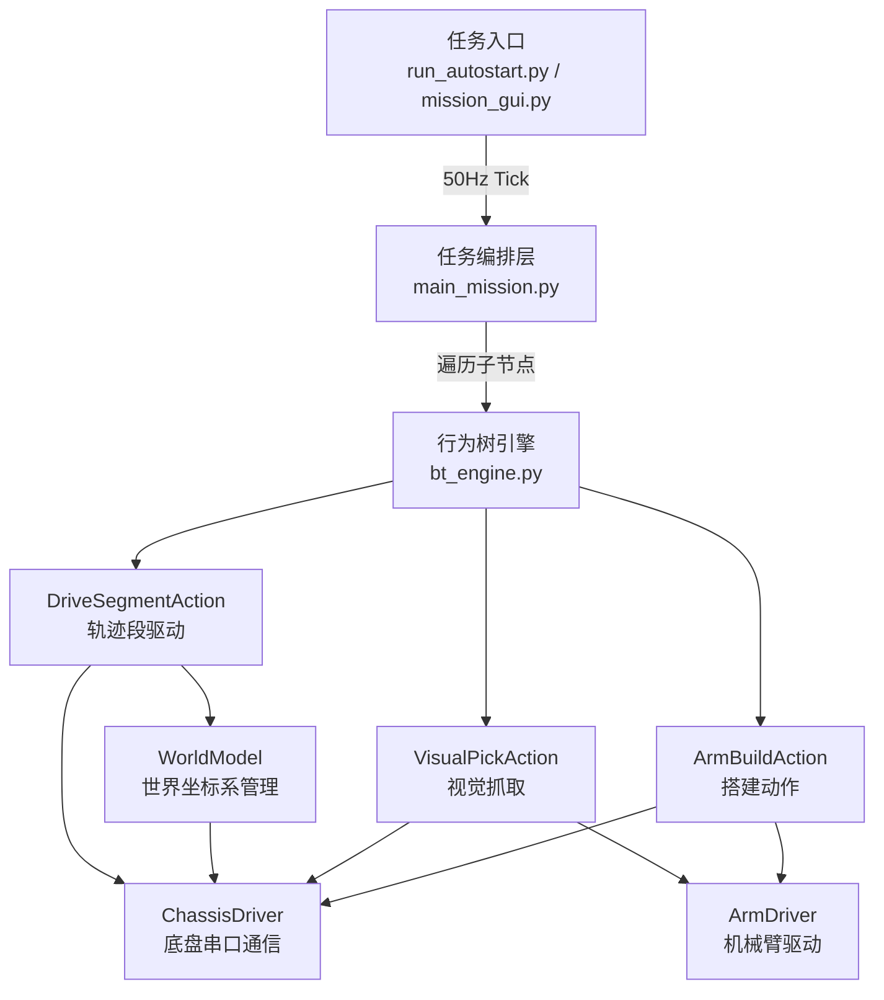
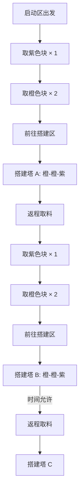
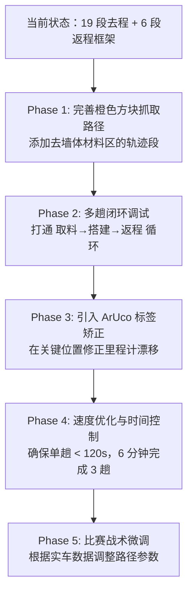

# RoboGame 2026 运动路径规划全面分析报告

## 目录
1. [问题一：当前运动设计思路与添加路径指南](#一当前运动设计思路与添加路径指南)
2. [问题二：基于比赛规则的路径规划与其他设计思路](#二基于比赛规则的路径规划与其他设计思路)

---

## 一、当前运动设计思路与添加路径指南

### 1.1 系统架构总览

当前的运动系统采用 **"分层解耦 + 行为树驱动 + 相对位移累加 + 世界模型闭环推算"** 的设计：



#### 核心设计原则

| 原则 | 说明 |
|------|------|
| **纯相对位移** | 底盘只执行车体坐标系下的 `move(dx, dy, dyaw)`，不感知全局地图 |
| **世界模型解耦** | `WorldModel` 维护全局绝对期望位姿，动态计算剩余位移投影回车体坐标 |
| **断点续跑** | 暂停/碰撞后恢复时，自动计算当前位置到本段终点的剩余向量，无需从头重跑 |
| **单轴到位判定** | 防止麦轮横移串扰漂移导致欧氏距离误判，按主运动轴单独判到位 |

### 1.2 轨迹数据结构

路径定义在 [mission_config.py](file:///D:/competition_code/rb_competition_code/rb_pi/pi/robogame_project/config/mission_config.py) 中：

```python
@dataclass
class TrajectorySegment:
    name: str       # 轨迹段标识名（可读性）
    dx: float = 0.0 # 前进位移（m，前进为正）
    dy: float = 0.0 # 横移位移（m，左移为正，麦轮横移）
    dyaw: float = 0.0 # 旋转位移（rad，逆时针为正）
```

> [!IMPORTANT]
> 每个 `TrajectorySegment` 代表一个**原子位移指令**，直接映射到底盘 `move` 命令。每段只在一个维度上运动（纯平移或纯旋转），不做复合运动——这是防止麦轮耦合漂移的关键设计决策。

### 1.3 当前 19 段去程轨迹

```mermaid
flowchart LR
    S0["#0 前进 0.6m<br/>脱离发车站"] --> S1["#1 右移 2.75m<br/>切入主道"]
    S1 --> S2["#2 前进 2.25m<br/>接近物料台"]
    S2 --> S3["#3 左移 0.5m<br/>靠近物料台"]
    S3 -->|视觉抓取| S4["#4 右移 0.6m<br/>脱离物料台"]
    S4 --> S5["#5 后退 2.25m<br/>退回拐角"]
    S5 --> S6["#6 左转 90°"]
    S6 --> S7["#7 右移 0.3m<br/>对齐走廊"]
    S7 --> S8["#8 右转 90°<br/>车头回正"]
    S8 --> S9["#9 前进 2.0m<br/>穿越走廊"]
    S9 --> S10["#10 左移 0.5m"]
    S10 --> S11["#11 右移 0.7m<br/>绕过立柱"]
    S11 --> S12["#12 右转 90°"]
    S12 --> S13["#13 左移 0.8m"]
    S13 --> S14["#14 右移 0.5m<br/>对正通道"]
    S14 --> S15["#15 右转 90°"]
    S15 --> S16["#16 前进 2.3m"]
    S16 --> S17["#17 右转 90°<br/>对齐搭建台"]
    S17 --> S18["#18 前进 2.6m<br/>到达搭建区"]
```



### 1.4 当前 6 段返程轨迹

```python
RETURN_TRAJECTORY = [
    TrajectorySegment(name="return_backward_0.6m", dx=-0.60),     # 后退脱离搭建台
    TrajectorySegment(name="return_turn_180deg",   dyaw=3.1416),  # 掉头旋转
    TrajectorySegment(name="return_forward_2.6m",  dx=2.60),      # 沿走廊返回
    TrajectorySegment(name="return_turn_left_90",  dyaw=1.5708),  # 接入中转走廊
    TrajectorySegment(name="return_forward_2.3m",  dx=2.30),      # 中转走廊通行
    TrajectorySegment(name="return_left_0.5m",     dy=0.50),      # 对齐物料区
]
```

---

### 1.5 ⭐ 添加新路径的完整指南

添加新路径需要修改 **2 个文件**，涉及 **3 个步骤**：

#### 步骤 1：在 `mission_config.py` 中添加轨迹段

> 文件位置：[config/mission_config.py](file:///D:/competition_code/rb_competition_code/rb_pi/pi/robogame_project/config/mission_config.py)

**方法 A：修改现有轨迹列表**

在 `DEFAULT_TRAJECTORY` 或 `RETURN_TRAJECTORY` 列表中直接插入/追加新段：

```python
# 示例：在段 18 之后添加搭建区内部微调段
DEFAULT_TRAJECTORY: List[TrajectorySegment] = [
    # ... 原有 0~18 段不变 ...
    TrajectorySegment(name="forward_2.6m",     dx=2.6,   dy=0.0,   dyaw=0.0),   # 原段 18
    # ★ 新增：搭建区内横移到第二个搭建点
    TrajectorySegment(name="build_shift_right", dx=0.0,   dy=-0.25, dyaw=0.0),   # 新段 19
]
```

**方法 B：创建全新的独立轨迹**

```python
# 新增一条"去屋顶材料区"的专用轨迹
ROOF_MATERIAL_TRAJECTORY: List[TrajectorySegment] = [
    TrajectorySegment(name="roof_forward_1m",   dx=1.0),
    TrajectorySegment(name="roof_left_0.8m",    dy=0.80),
    TrajectorySegment(name="roof_turn_left_90", dyaw=1.5708),
    TrajectorySegment(name="roof_forward_0.5m", dx=0.50),
]
```

**方法 C：修改 `get_mission_trajectory` 函数组合轨迹**

```python
def get_mission_trajectory(include_return: bool = False, 
                           include_roof: bool = False) -> List[TrajectorySegment]:
    traj = list(DEFAULT_TRAJECTORY)
    if include_roof:
        traj += list(ROOF_MATERIAL_TRAJECTORY)
    if include_return:
        traj += list(RETURN_TRAJECTORY)
    return traj
```

> [!TIP]
> **坐标系约定速记**：
> - `dx > 0` = 车头方向前进 | `dx < 0` = 后退
> - `dy > 0` = 向左横移 | `dy < 0` = 向右横移  
> - `dyaw > 0` = 逆时针旋转 | `dyaw < 0` = 顺时针旋转
> - `90° = 1.5708 rad` | `180° = 3.1416 rad`

#### 步骤 2：在 `main_mission.py` 中挂接特殊动作

> 文件位置：[missions/main_mission.py](file:///D:/competition_code/rb_competition_code/rb_pi/pi/robogame_project/missions/main_mission.py)

如果新路径段之后需要触发**视觉抓取**或**机械臂搭建**等特殊动作，需要修改任务编排逻辑：

```python
def create_mission_tree(chassis, world_model, ir_sensor=None,
                        detector=None, camera=None, arm=None,
                        enable_build: bool = True):
    actions = [ResetOdomAction(chassis, world_model)]
    for i in range(len(world_model.trajectory)):
        actions.append(DriveSegmentAction(chassis, world_model))
        
        # ★ 原有：段 3 后视觉抓取紫色块
        if i == 3 and detector and camera and arm:
            actions.append(VisualPickAction(chassis, detector, camera, arm))
        
        # ★ 原有：段 18 后搭建第一层
        if i == 18 and arm and enable_build:
            actions.append(ArmBuildAction(chassis, arm, 
                           group_id=ArmDriver.GROUP_BUILD_1, duration=12.0))
        
        # ★ 新增示例：段 19（新增的 build_shift_right）后搭建第二层
        if i == 19 and arm and enable_build:
            actions.append(ArmBuildAction(chassis, arm,
                           group_id=ArmDriver.GROUP_BUILD_2, duration=12.0))
        
        # ★ 新增示例：在返程的某段后触发橙色方块抓取
        if i == 25 and detector and camera and arm:
            actions.append(VisualPickAction(chassis, detector, camera, arm))
    
    actions.append(StopAction(chassis))
    return Sequence(actions)
```

> [!WARNING]
> **关键注意事项**：段索引 `i` 是基于 `world_model.trajectory` 列表的全局索引。如果你在 `DEFAULT_TRAJECTORY` 中间插入了新段，所有后续段的索引都会后移！建议改用 **段名称匹配** 替代硬编码索引：
> ```python
> seg = world_model.trajectory[i]
> if seg.name == "left_0.5m" and detector and camera and arm:
>     actions.append(VisualPickAction(...))
> ```

#### 步骤 3：更新 `MissionConfig` 使新轨迹生效

```python
# 在 mission_config.py 底部
GLOBAL_CONFIG = MissionConfig(
    trajectory=get_mission_trajectory(include_return=True),  # ← 开启返程
    enable_return_trip=True,
)
```

#### 完整改动清单汇总

| 改动位置 | 文件 | 改什么 |
|----------|------|--------|
| **1. 定义轨迹段** | [mission_config.py](file:///D:/competition_code/rb_competition_code/rb_pi/pi/robogame_project/config/mission_config.py) | 在 `DEFAULT_TRAJECTORY` / `RETURN_TRAJECTORY` 中添加 `TrajectorySegment` |
| **2. 挂接特殊动作** | [main_mission.py](file:///D:/competition_code/rb_competition_code/rb_pi/pi/robogame_project/missions/main_mission.py) | 在 `create_mission_tree` 的 for 循环中按段索引/段名称插入行为节点 |
| **3. 调整运动参数** | [mission_config.py](file:///D:/competition_code/rb_competition_code/rb_pi/pi/robogame_project/config/mission_config.py) | 如有需要，修改 `ChassisLimitConfig`（速度、容差等） |
| **4.（可选）新增动作节点** | [custom_actions.py](file:///D:/competition_code/rb_competition_code/rb_pi/pi/robogame_project/behavior_tree/custom_actions.py) | 如需全新的行为（如红外巡线辅助），继承 `BTNode` 实现 |

> [!NOTE]
> `WorldModel` 会自动处理新增段的坐标变换与到位判定，**不需要修改** [world_model.py](file:///D:/competition_code/rb_competition_code/rb_pi/pi/robogame_project/environment/world_model.py)。它通过遍历 `self.trajectory` 列表自动适配任意数量的段。

---

## 二、基于比赛规则的路径规划与其他设计思路

### 2.1 比赛规则核心要点（影响路径规划的关键条款）

根据 [RoboGame2026 竞技组规则手册](file:///D:/competition_code/rb_competition_code/RoboGame-Team/docs/rules) 提取的关键信息：

| 规则项 | 具体数值 | 对路径规划的影响 |
|--------|----------|-----------------|
| **场地尺寸** | 7.2m × 4.8m（含 0.4m 高黑色围墙） | 半场实际可用约 3.6m × 4.8m |
| **比赛时间** | 1 分钟准备 + **6 分钟正式** | 单趟需控制在 90-120s 内 |
| **半场对称** | 完全中心对称，双方各自运行 | 仅需规划己方半场路径 |
| **启动区** | 600×600mm 方框 | 车辆初始包络不得超出 |
| **搭建区** | 2.4m × 0.6m，高 100mm | 3 座塔的搭建位置 |
| **中央高地** | 1.8m × 1.7m，高 200mm | 斜坡 14°，需考虑是否上坡 |
| **墙体材料区** | 1.8m × 0.3m，槽深 50mm | 10 个橙色方块在 1500mm 长槽中 |
| **屋顶材料区** | 2.2m × 0.4m，3 个 110mm 方槽 | 3 个紫色方块，间距 200mm |
| **携带限制** | 最多 3 块，最多 1 紫色 | 每趟最优组合 = 2橙 + 1紫 |
| **巡线** | 5cm 黑色胶带，±5% 误差 | 连接各区域中线 |
| **视觉标签** | 6 个 15×15cm，墙面高 40cm | 可用于里程计矫正 |

#### 得分机制（直接决定策略优先级）

```
保底分 G = S1 + S2
  S1 = 成功抓取任一方块（得 1 分，仅记一次）
  S2 = 成功放置到搭建区（得 1 分，仅记一次）

建筑分（按 TOP 3 建筑计分）:
  第 1 层 = 0 分
  第 2 层 = 1 分  
  第 3 层 = 2 分
  第 4 层 = 3 分
  ... 上不封顶

紫色屋顶封顶倍率 = 整栋建筑分 × 1.5

示例：2 橙 + 1 紫（3 层塔）= (0+1) × 1.5 = 1.5 分
示例：3 橙 + 1 紫（4 层塔）= (0+1+2) × 1.5 = 4.5 分
```

> [!IMPORTANT]
> **关键发现**：紫色屋顶的 ×1.5 倍率作用于**所有层的累计分数**，而非仅顶层。这意味着层数越高，紫色屋顶带来的绝对收益越大。4 层带紫顶 = 4.5 分 vs 4 层纯橙 = 3 分，差距 50%。

### 2.2 当前路径规划的优缺点分析

#### ✅ 优势
1. **架构成熟**：行为树 + 世界模型的解耦设计，容错性强
2. **断点续跑**：暂停恢复不丢步，实战价值极高
3. **单轴判定**：针对麦轮横移串扰的工程化解决方案
4. **心跳保活**：30ms 周期保活解除下位机看门狗

#### ⚠️ 当前不足
1. **纯开环航位推算**：14 米全场累计漂移可能达 10-20cm
2. **硬编码段索引**：`if i == 3` 这种硬编码在插入段后容易出错
3. **单一路径策略**：只有一条固定路径，无法根据比赛动态调整
4. **仅取紫色块**：当前只在段 3 抓取紫色块，未规划去橙色墙体材料区的路径
5. **返程未闭环**：返程轨迹只有 6 段框架，未与物料台抓取对接

### 2.3 ⭐ 比赛路径规划的策略建议

#### 策略 A：稳健优先策略（推荐首选）

**核心思想**：先锁保底分，再稳定搭建 2-3 座 3 层塔（2 橙 + 1 紫）



**预计得分**：
- 保底分 = 2 分（首抓 + 首放）
- 每座 3 层紫顶塔 = (0 + 1) × 1.5 = 1.5 分
- 2 座塔总分 = 2 + 1.5 × 2 = **5 分**
- 3 座塔总分 = 2 + 1.5 × 3 = **6.5 分**

**需要规划的路径**：
1. 启动区 → 屋顶材料区（紫色）
2. 屋顶材料区 → 墙体材料区（橙色）
3. 墙体材料区 → 搭建区
4. 搭建区 → 屋顶材料区（返程循环）

#### 策略 B：高塔激进策略

**核心思想**：集中所有方块搭建 1 座尽可能高的塔

```
1 座 6 层橙 + 1 紫顶 = (0+1+2+3+4+5) × 1.5 = 22.5 分！
```

**优势**：理论得分极高  
**风险**：高层搭建容易倒塌；一旦倒塌得 0 分；需要多趟运输

#### 策略 C：多塔分散策略

**核心思想**：搭 3 座低层但稳定的塔

```
3 座 2 层橙塔（无紫顶）= 1 + 1 + 1 = 3 分（建筑分）+ 2 分保底 = 5 分
3 座 2 层塔（带紫顶）= 1.5 + 1.5 + 1.5 = 4.5 分 + 2 分保底 = 6.5 分
```

**优势**：最稳定，机械臂精度要求低  
**劣势**：需要 3 趟运输，时间紧张

### 2.4 ⭐ 推荐的路径规划改进方案

#### 改进 1：增加屋顶材料区路径

当前代码只去了"物料台"（推测是紫色屋顶材料区），还需要添加去**橙色墙体材料区**的路径。根据场地布局，橙色墙体材料区在中央高地区上方（需要上 14° 斜坡）。

```python
# 建议新增：从发车站到橙色墙体材料区的轨迹
ORANGE_MATERIAL_TRAJECTORY: List[TrajectorySegment] = [
    TrajectorySegment(name="om_forward_0.6m",    dx=0.60),      # 脱离发车站
    TrajectorySegment(name="om_right_1.0m",      dy=-1.00),     # 切入主道
    TrajectorySegment(name="om_forward_to_ramp",  dx=1.50),     # 接近斜坡
    TrajectorySegment(name="om_up_ramp",          dx=0.80),     # 上斜坡（需要更高速度/扭矩）
    TrajectorySegment(name="om_left_to_slot",     dy=0.30),     # 横移到方块槽位
]
```

> [!WARNING]
> **上坡路径是关键难点**：14° 斜坡对麦轮底盘是挑战。打滑会导致里程计严重漂移。建议：
> 1. 上坡段使用更低速度但更高加速度
> 2. 在坡顶处用视觉标签或黑线进行位置矫正
> 3. 或者完全避开上坡——分析是否有绕行的平地路线

#### 改进 2：引入视觉标签矫正（抑制长距离漂移）

```python
# 建议新增行为节点：ArUco 标签定位矫正
class TagCorrectionAction(BTNode):
    """在特定段后，通过墙壁上的 ArUco 标签矫正里程计漂移。"""
    def __init__(self, chassis, world_model, camera, tag_id: int):
        self.chassis = chassis
        self.world = world_model
        self.camera = camera
        self.tag_id = tag_id
    
    def tick(self) -> NodeStatus:
        # 1. 拍照检测 ArUco 标签
        # 2. 根据标签位姿计算机器人真实全局坐标
        # 3. 更新 world_model.expected_pose 修正漂移
        pass
```

#### 改进 3：段名称匹配代替硬编码索引

```python
# 改进前（脆弱）:
if i == 3 and detector and camera and arm:
    actions.append(VisualPickAction(...))

# 改进后（健壮）:
seg = world_model.trajectory[i]
if seg.name == "left_0.5m" and detector and camera and arm:
    actions.append(VisualPickAction(...))
```

#### 改进 4：多趟闭环路径规划

完整的多趟运输需要规划一个**环形路径**：

```
趟 1: 启动区 → 紫色材料区 → 橙色材料区 → 搭建区 → 搭建
趟 2: 搭建区 → 紫色材料区 → 橙色材料区 → 搭建区 → 搭建
趟 3: 搭建区 → 橙色材料区 → 搭建区 → 搭建（如果紫色块用完）
```

### 2.5 其他可能的设计思路

#### 思路 1：ROS 2 节点式架构（已有模板）

你的 [RoboGame-Team/code](file:///D:/competition_code/rb_competition_code/RoboGame-Team/code/README.md) 目录中已经有一套**完整的 ROS 2 架构模板**，采用：

| 组件 | 文件 | 功能 |
|------|------|------|
| `planner_node.py` | FSM 状态机 | 比赛全流程任务调度 |
| `perception_node.py` | OpenCV 感知 | 巡线 + 方块检测 + ArUco 标签 |
| `controller_node.py` | 运动控制 | 位姿跟踪 + 巡线 PID + 视觉逼近 |
| `localization_node.py` | 融合定位 | 里程计 + ArUco 标签互补滤波 |
| `mecanum_kinematics_node.py` | 运动学 | cmd_vel → 四轮速度 |

**与当前方案的关键差异**：

| 特性 | 当前 pi 方案 | ROS 2 模板方案 |
|------|-------------|---------------|
| 路径定义 | 硬编码相对位移段 | YAML 航点坐标 |
| 定位方式 | 纯里程计累加 | 里程计 + ArUco 融合 |
| 导航方式 | 逐段 move 指令 | 巡线 PID + 位姿跟踪 |
| 抓取触发 | 固定在段 3 后 | FSM 状态驱动 |
| 架构 | 单进程 Python | 多节点 ROS 2 |

> [!TIP]
> **建议**：当前 pi 方案更适合**快速实车调试**（距离比赛很近），ROS 2 方案更适合**长期迭代**。可以在当前 pi 方案中**逐步融入** ROS 2 模板的核心算法（如 ArUco 定位矫正、巡线 PID），而不是全部推翻重写。

#### 思路 2：巡线导航 + 航点切换

利用场地上的 5cm 黑色巡线作为主导航方式：

```
优势：
- 黑线铺设精确，不会累积漂移
- 抗打滑能力强
- 实现简单（红外/摄像头 + PID）

劣势：
- 速度较慢（需要持续跟线）
- 岔路口需要决策逻辑
- 依赖线的完整性
```

**混合方案**：长距离走巡线（消除漂移），短距离用相对位移（速度快）。

#### 思路 3：航点导航 + 标签矫正

将路径定义为**世界坐标系下的绝对航点**，而非相对位移：

```yaml
waypoints:
  - {name: "start_exit",  x: 0.60, y: 0.60, yaw: 0.00}
  - {name: "wall_entry",  x: 2.20, y: 2.00, yaw: 0.00}
  - {name: "build_tower_a", x: 1.55, y: 0.55, yaw: 1.57}
```

**优势**：路径规划更灵活，可以动态调整目标点  
**劣势**：需要全局定位能力（目前没有 SLAM 或激光雷达）

#### 思路 4：分区速度策略

根据场地区域动态调整运动速度：

| 区域 | 建议速度 | 原因 |
|------|----------|------|
| 长走廊直行 | 0.50 m/s（高速） | 两侧有护栏保护 |
| 斜坡上坡 | 0.20 m/s（低速高扭矩） | 防打滑 |
| 物料台靠近 | 0.15 m/s（精细） | 需要精准停车 |
| 搭建区就位 | 0.10 m/s（超精细） | 毫米级对位 |
| 原地旋转 | 0.80 rad/s | 快速转向 |

### 2.6 综合推荐实施路线图



| 阶段 | 优先级 | 预计工作量 | 核心改动文件 |
|------|--------|-----------|-------------|
| Phase 1 | 🔴 最高 | 2-3 天 | `mission_config.py`, `main_mission.py` |
| Phase 2 | 🔴 最高 | 3-5 天 | `mission_config.py`, `main_mission.py` |
| Phase 3 | 🟡 中 | 3-5 天 | 新增 `tag_correction.py`, `vision/aruco_detector.py` |
| Phase 4 | 🟡 中 | 2-3 天 | `mission_config.py`（速度参数调优） |
| Phase 5 | 🟢 低 | 比赛前持续 | 所有配置文件 |
